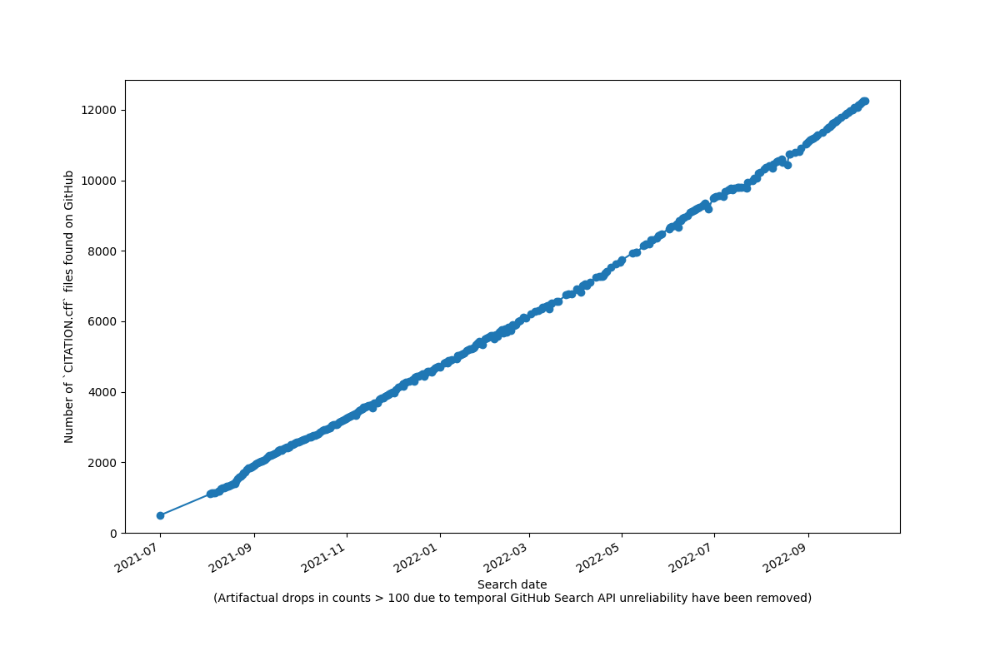

<!--
SPDX-FileCopyrightText: 2021 Stephan Druskat <mail@sdruskat.net>
SPDX-License-Identifier: CC-BY-4.0
-->

# cfftracker

Tracks `CITATION.cff` files across public repositories on GitHub.

## Current count: 5284

Note: This plot has been produced on cleaned up data that disregards drops in counts of > 100.
These steep drops are due to temporal unreliabilities in results from the GitHub Search API, 
caused by backend work on GitHub at the time of the query (source: personal communication with GitHub staff).
For a plot of the uncleaned data, see [cff_counts.png](cff_counts.png).

## Documentation

The tracker uses a [GitHub Action workflow](.github/workflows/update.yml) to [query](query_api.py) the [GitHub Search API](https://docs.github.com/en/rest/reference/search) (basically an authenticated call to  `https://api.github.com/search/code?q=filename:CITATION.cff`) for files with the filename `CITATION.cff`.

The total count is then extracted from the API response, added with the current date to a [CSV file](cff_counts.csv), written to a [text file](current_count.txt) (for easy extraction), and put in `README.md` using regex replacement for the `## Current count: nnnn` line.

[Another script](clean_plot.py) using [pandas](https://pandas.pydata.org/) and [matplotlib](https://matplotlib.org/) creates the graph you see above.

And finally, all updated files are committed and pushed back into this repository.

## Licenses

Copyright © 2021 Stephan Druskat

This work is licensed under multiple licenses:

Code is licensed under MIT.
Documentation files and images are licensed under CC-BY-4.0.
The remaining files are licensed under CC0-1.0.

Please see the individual files for more accurate information.
